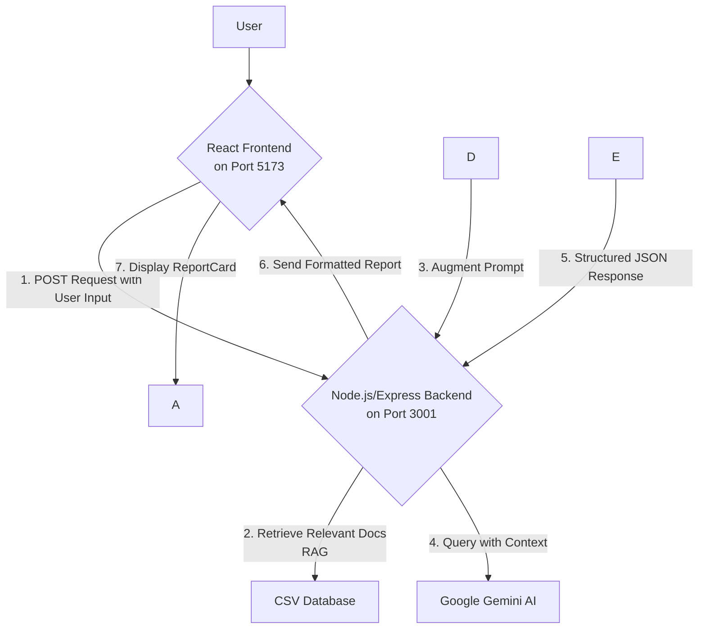

\# 🚦Road-Safety-Intervention-GPT


An AI-powered expert system designed to identify and recommend precise road safety interventions based on natural language descriptions of hazardous conditions. This project was developed for the \*\*National Road Safety Hackathon 2025\*\*.


\## 🚀 Live Demo


\*\*\[Insert Your Deployed Vercel/Netlify URL Here]\*\*


> \*\*Note:\*\* The backend may take a few seconds to "wake up" on the first request due to the cold start nature of serverless functions.

<br>

\## 📝 Problem Statement


As per the hackathon brief, selecting appropriate road safety interventions is critical for effective mitigation. This project provides a tool that queries a curated database of best practices and guidelines to provide the most suitable intervention for a given road safety issue. <br>


\## ✨ Key Features


\- \*\*Sophisticated AI Core (RAG Engine):\*\*


Uses a Retrieval-Augmented Generation pipeline that retrieves the most relevant technical data from the CSV knowledge base, then generates precise, context-aware recommendations.


\- \*\*Advanced Prompt Engineering:\*\*


Powered by a master prompt with strict guardrails and an expert persona, the AI always responds in a clean, structured JSON format.


\- \*\*Modern Full-Stack Architecture:\*\*


Built with a decoupled \*\*React frontend\*\* and \*\*Node.js/Express backend\*\* for clean separation, scalability, and maintainability.


\- \*\*QR Code \& Report Sharing System:\*\*


Users can instantly share analysis results through a unique URL and dynamic QR code.


\- \*\*Polished \& Responsive UI/UX:\*\*


Designed with Tailwind CSS for a modern experience with loading skeletons, intuitive feedback, and full responsiveness.

<br>

\## 🏗️ Architecture Diagram


This project follows a decoupled, full-stack architecture.





<br>

\## 🛠️ Tech Stack


| Area     | Technology                              |

| -------- | --------------------------------------- |

| Frontend | React, Vite, Tailwind CSS, React Router |

| Backend  | Node.js, Express.js, dotenv             |

| AI       | Google Gemini API                       |

| Database | CSV file parsed with csv-parse          |

<br>

\## 🚀 Getting Started (Local Setup)


Follow these instructions to run the full-stack application locally.

\### Prerequisites


\* Node.js (v18.x or higher)


\* Git


\* Google Gemini API Key


\## \*\*1. Clone the Repository\*\*


```


git clone https://github.com/jayadeep8712/Road-Safety-GPT.git


cd road-safety-expert-system


```


\## \*\*2. Set Up the Backend\*\*


\### 1. Navigate to the backend directory:


```


cd backend


```


\### 2. Install dependencies:


```


npm install


```


\### 3. Create a `.env` file in the backend directory.


\### 4. Add your Gemini API key:


```


GEMINI\_API\_KEY="your-secret-api-key-here"


```


\## \*\*3. Set Up the Frontend\*\*


\### 1. Navigate to the frontend directory:


```


cd frontend


```


\### 2. Install dependencies:


```


npm install


```


\## \*\*4. Run the Application\*\*


Open two terminals:


\### Start the Backend


```


node server.js


```


You should see: `🚀 Backend server is running on http://localhost:3001`


\### Start the Frontend


```


npm run dev


```


Open the provided URL, typically `http://localhost:5173`. <br>

\## 🔮 Future Improvements


\* Image Upload: Analyze road safety issues via multimodal AI.


\* Geolocation: Tag reports with GPS coordinates.


\* Advanced RAG: Use vector embeddings for semantic search.


\* User Authentication \& History: Allow login and report history.


\*\*Developed by Team The Safe-T-Bytes\*\*


