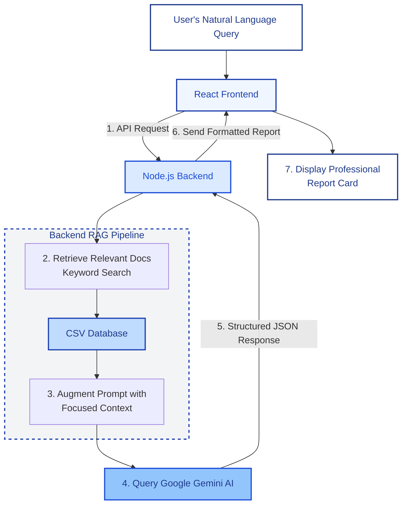

<h1 align="center">
#🚦Road-Safety-Intervention-GPT
</h1>

<p align="center">
  <i><b>Analyze road safety issues with AI. Get expert recommendations from official guidelines.</i>
</b></p>

<p align="center">
  
  
  
  
  
  
</p>

<p align="center">
  
  
  
</p>


<br/>

An AI-powered expert system designed to identify and recommend precise road safety interventions based on natural language descriptions of hazardous conditions. This project was submitted for the **National Road Safety Hackathon 2025**.

<br/>

## 🎯 The Problem

Road safety engineers, city planners, and even concerned citizens often face a significant challenge: identifying the correct, standards-compliant intervention for a specific safety issue. Manually searching through dense technical manuals (like IRC guidelines) is slow, inefficient, and prone to error. 

This knowledge gap can delay the implementation of critical safety improvements, directly impacting public safety. Our project was designed to bridge this gap.

<br/>

## ✨ Key Features

<table>
  <tr>
    <td width="50%" valign="top">
      <h3>🤖 Sophisticated AI Core (RAG Engine)</h3>
      <p>Employs a <strong>Retrieval-Augmented Generation (RAG)</strong> pipeline. The system first retrieves the most relevant technical documents from the knowledge base before asking the AI to generate a precise, context-aware, and hallucination-free recommendation.</p>
    </td>
    <td width="50%" valign="top">
      <h3>🧠 Advanced Prompt Engineering</h3>
      <p>Powered by a meticulously crafted "master prompt" that defines a strict expert persona, robust guardrails, and structured JSON-only output. The AI can gracefully handle off-topic and out-of-scope questions.</p>
    </td>
  </tr>
  <tr>
    <td width="50%" valign="top">
      <h3>🏗️ Modern Full-Stack Architecture</h3>
      <p>Built with a decoupled <strong>React frontend</strong> (hosted on Vercel) and a <strong>Node.js/Express backend</strong> (hosted on Render), ensuring a clean separation of concerns, scalability, and maintainability.</p>
    </td>
    <td width="50%" valign="top">
      <h3>🔗 Dynamic Report Sharing System</h3>
      <p>Instantly generate unique shareable links and dynamic <strong>QR codes</strong> for any report. The system uses a temporary online store (JSONBlob) to create short, clean URLs that are perfect for sharing.</p>
    </td>
  </tr>
  <tr>
    <td width="50%" valign="top">
      <h3>📄 Professional PDF Generation</h3>
      <p>Download any report as a high-quality, watermarked <strong>PDF document</strong>. This feature is perfect for official documentation, archiving, and offline use.</p>
    </td>
    <td width="50%" valign="top">
      <h3>🎨 Polished & Engaging UI/UX</h3>
      <p>Designed with <strong>Tailwind CSS</strong> for a modern, fully responsive experience. The app features an engaging avatar-led intro, informative loading skeletons, and a clear, intuitive interface.</p>
    </td>
  </tr>
</table>


<br/>


## 🏗️ Architecture Diagram

This project follows a decoupled, full-stack architecture.




<br/>


## 🛠️ Tech Stack & Architecture

This project is built on a modern, decoupled full-stack architecture, leveraging best-in-class tools for each part of the application lifecycle.

### Core Technologies

<div align="center">
  <p><strong>Frontend</strong></p>
  
  <p><strong>Backend & AI</strong></p>
  
  <p><strong>Deployment & Tools</strong></p>
  
</div>


<br/>


### Detailed Breakdown

<table align="center" width="100%">
  <thead>
    <tr>
      <th align="left">Category</th>
      <th align="left">Technology</th>
      <th align="left">Purpose</th>
    </tr>
  </thead>
  <tbody>
    <tr>
      <td rowspan="4"><b>Frontend</b></td>
      <td>React 18.2.0</td>
      <td>Building the core user interface and managing component state.</td>
    </tr>
    <tr>
      <td>Vite 5.2.0</td>
      <td>Providing a fast and efficient development server and build process.</td>
    </tr>
    <tr>
      <td>TailwindCSS 3.4.3</td>
      <td>Rapidly styling a modern, responsive, and utility-first UI.</td>
    </tr>
    <tr>
      <td>React Router DOM</td>
      <td>Enabling client-side routing for shareable report pages (<code>/report</code>).</td>
    </tr>
    <tr>
      <td rowspan="3"><b>Frontend Features</b></td>
      <td><code>jspdf</code> + <code>html2canvas</code></td>
      <td>Generating downloadable, watermarked PDF reports directly from HTML.</td>
    </tr>
    <tr>
      <td><code>qrcode</code></td>
      <td>Creating scannable QR codes for the report sharing feature.</td>
    </tr>
    <tr>
      <td><code>@dicebear/bottts-neutral</code></td>
      <td>Generating unique, friendly AI avatars for the introductory sequence.</td>
    </tr>
    <tr>
      <td rowspan="3"><b>Backend</b></td>
      <td>Node.js</td>
      <td>The JavaScript runtime environment for the server.</td>
    </tr>
    <tr>
      <td>Express.js</td>
      <td>Handling API routing, requests, and responses for the backend server.</td>
    </tr>
    <tr>
      <td><code>cors</code> & <code>dotenv</code></td>
      <td>Managing cross-origin requests and secret environment variables (API Key).</td>
    </tr>
    <tr>
      <td><b>AI & NLP</b></td>
      <td>Google Gemini 1.5 Flash</td>
      <td>The core AI model for analyzing user input and generating structured JSON reports.</td>
    </tr>
    <tr>
      <td><b>Database</b></td>
      <td>CSV + <code>csv-parse</code></td>
      <td>Storing and reliably parsing the curated road safety intervention data.</td>
    </tr>
    <tr>
      <td rowspan="2"><b>Deployment</b></td>
      <td>Vercel</td>
      <td>Hosting the globally-distributed, high-performance React frontend.</td>
    </tr>
    <tr>
      <td>Render</td>
      <td>Hosting the persistent Node.js/Express backend server.</td>
    </tr>
  </tbody>
</table>


<br/>


## 🚀 Getting Started (Local Setup)

Follow these instructions to run the full-stack application locally.

### Prerequisites

- Node.js (v18.x or higher)
- npm
- Google Gemini API Key (Get one free at https://aistudio.google.com/app/api-keys)

### 1. Clone the Repository

```bash
git clone https://github.com/jayadeep8712/Road-Safety-GPT.git
cd road-safety-expert-system
```

### 2. Set Up the Backend

**Navigate to the backend directory:**

```bash
cd backend
```

**Install dependencies:**

```bash
npm install
```

**Create a `.env` file in the backend directory**

**Add your Gemini API key:**

```env
GEMINI_API_KEY="your-secret-api-key-here"
```

### 3. Set Up the Frontend

**Navigate to the frontend directory:**

```bash
cd frontend
```

**Install dependencies:**

```bash
npm install
```

### 4. Run the Application

Open two terminals:

**Terminal 1 - Start the Backend**

```bash
cd backend
node server.js
```

You should see: `🚀 Backend server is running on http://localhost:3001`

**Terminal 2 - Start the Frontend**

```bash
cd frontend
npm run dev
```

<div align="center">

### 🎉 That's it! Open http://localhost:5173

</div>


<br/>


## 🚀 Live Demo

**Live App:** [**RSES | Road Safety Expert System**](https://road-safety-expert-system.vercel.app)

*(**Note:** The backend is hosted on Render's free tier and may take up to 60 seconds to "wake up" on the first request if it has been inactive.)*

<br/>

## 🤝 Contributing

<div align="center">

**We love contributions!** 💙

Whether it's bug fixes, new features, or documentation improvements,<br/>
all contributions are welcome and appreciated.

</div>

### How to Contribute

1. **Fork** the repository
2. **Create** a feature branch (`git checkout -b feature/amazing-feature`)
3. **Commit** your changes (`git commit -m 'Add amazing feature'`)
4. **Push** to the branch (`git push origin feature/amazing-feature`)
5. **Open** a Pull Request


<br/>


## 🌟 Show Your Support

<div align="center">

If this project helped you, please consider giving it a ⭐!

<a href="https://github.com/jayadeep8712/Road-Safety-GPT">
  
</a>
</div>

<br/>

## 📄 License

<div align="center">

This project is licensed under the **MIT License**

</div>


<div align="center">

<br/>

<sub>Built with React • Powered by AI • Deployed on Vercel</sub>

</div>